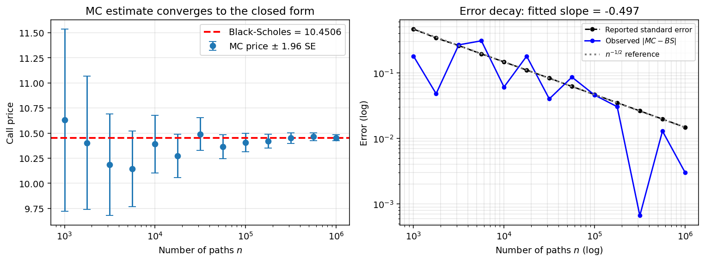
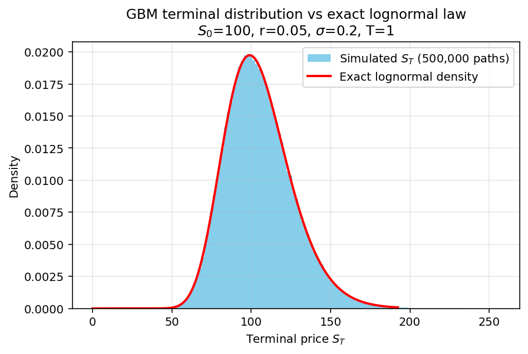
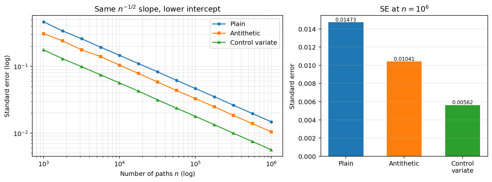
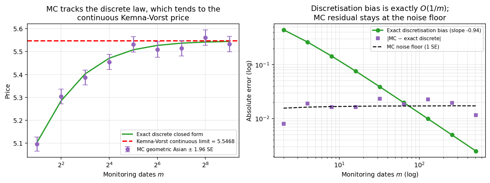
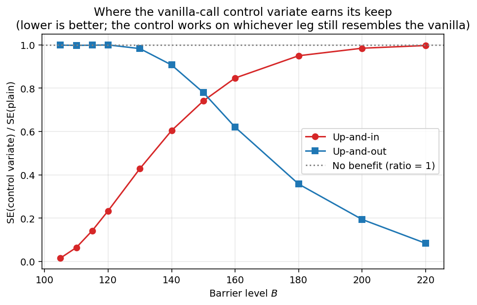
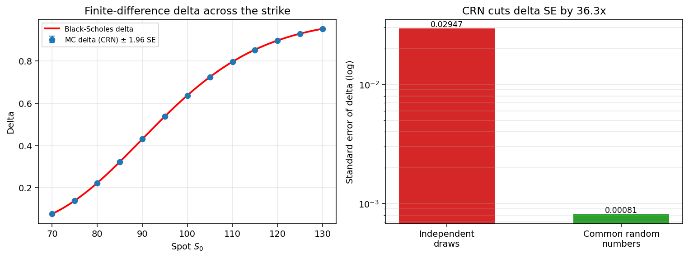

# Monte Carlo Options Pricing Engine

A NumPy Monte Carlo engine that prices European, Asian and barrier options under geometric Brownian motion; where every reported number carries a standard error, and every feature is validated against a closed form or a model-free identity.

- **Pure Python / NumPy**, vectorised over paths hence no loops over simulations
- **Dependencies:** `numpy`, `scipy`, `matplotlib` only
- **Three estimators:** plain, antithetic, control variate; all three measured at the predicted variance ratio
- **Every figure is reproducible:** `python3 make_assets.py` regenerates all six plots and `assets/results.json` from seeded runs

---

## Overview

The engine samples terminal and full-path GBM trajectories under the risk-neutral measure, applies a payoff object to the resulting price matrix, discounts, and reports the sample mean together with its standard error. Payoffs cover European calls and puts, arithmetic and geometric Asians, and up/down knock-in and knock-out barriers. Three estimators are available: plain Monte Carlo, antithetic variates, and a control variate with the optimal β estimated from the sample, and first- and second-order Greeks are computed by central finite differences driven by common random numbers.

The design is the differentiator: **no number is reported without a standard error, and no feature is considered working until it has been checked against a closed form or a model-free identity.** Every claim in the Validation section below is a specific, falsifiable check with its residual quoted in units of that standard error.

---

## Method

**Exact GBM sampling.** Paths are generated from the exact solution of the SDE rather than by Euler discretisation:

$$
S_{t+\Delta} = S_t \exp\left[\left(r - \tfrac{1}{2}\sigma^2\right)\Delta + \sigma\sqrt{\Delta}\, Z\right], \qquad Z \sim N(0,1).
$$

Because this is the exact transition law of the process, the simulated marginals carry **zero discretisation error** and the log-increments are i.i.d. Gaussian at any step size. Any bias that remains for a path-dependent product is therefore attributable to *monitoring* discretisation, not to the SDE solver. That distinction is made explicit in the Asian and barrier checks below.

**Risk-neutral pricing.** Under the risk-neutral measure $\mathbb{Q}$ the price is the discounted expected payoff, $V_0 = e^{-rT}\,\mathbb{E}^{\mathbb{Q}}[\,\Phi(S)\,]$. Monte Carlo replaces the expectation with a sample mean over $n$ independent paths, giving the estimator and its standard error

$$
\hat V = \frac{e^{-rT}}{n}\sum_{i=1}^{n}\Phi(S^{(i)}), \qquad \mathrm{SE}(\hat V) = \frac{\hat\sigma}{\sqrt{n}} .
$$

The $n^{-1/2}$ rate is dimension-free. It is the reason Monte Carlo is the tool of choice for path-dependent and high-dimensional payoffs but it comes at a cost: a tenfold accuracy gain costs a hundredfold more paths. That is what motivates variance reduction.

**Antithetic variates.** Each normal draw $Z$ is paired with $-Z$ and the two payoffs are averaged. The pair mean has variance $\tfrac{1}{2}\sigma^2(1+\rho_a)$ where $\rho_a=\mathrm{corr}(\Phi(Z),\Phi(-Z))$, so for the same total path count the SE ratio against plain MC is $\sqrt{1+\rho_a}$. The method only pays when the payoff is monotone enough in $Z$ to make $\rho_a$ negative.

**Control variates.** Given a correlated variable $X$ with known mean, the estimator $Y - \beta(X - \mathbb{E}[X])$ is unbiased for any $\beta$ and has minimum variance at $\beta^\star = \mathrm{Cov}(X,Y)/\mathrm{Var}(X)$, achieving an SE ratio of $\sqrt{1-\rho^2}$ (Glasserman, §4.1). Here $\beta^\star$ is estimated from the same sample, which introduces an $O(1/n)$ bias that is negligible at the path counts used. The engine uses the discounted terminal price $S_T$ (mean $S_0e^{rT}$) as the control for vanillas, and the vanilla call itself as the control for barriers.

**Path simulation for exotics.** Asians and barriers need the whole trajectory, so `gbm_price_array` returns an $(n_{\text{paths}} \times m{+}1)$ matrix whose first column is $S_0$ and whose remaining columns are the exponentiated cumulative log-increments. Payoff objects reduce that matrix along the time axis; a mean for Asians, a running extremum for barriers.

**Greeks by finite difference with CRN.** Sensitivities use central differences, e.g. $\Delta \approx [V(S_0+h)-V(S_0-h)]/2h$. The critical implementation detail is **common random numbers**: both bumped legs are driven by the *same* seed, so the difference is taken path by path and the shared Monte Carlo noise cancels inside the numerator instead of being amplified by the $1/2h$ factor. With independent draws the variance of the difference is $O(1)$ and the estimator variance blows up as $h^{-2}$; with CRN the differences are nearly deterministic and the variance stays controlled. The measured effect is a **36×** reduction in the standard error of delta.

For depth: Hull Ch. 14–15 (Wiener processes, Black–Scholes–Merton), Ch. 19 (the Greeks), Ch. 21 (numerical procedures); Glasserman Ch. 3 (path generation), Ch. 4 (variance reduction), Ch. 7 (estimating sensitivities).

---

## Validation

Unless noted, the test contract is $S_0 = 100$, $K = 100$, $r = 5\%$, $\sigma = 20\%$, $T = 1$. All figures and numbers below are regenerated by `python3 make_assets.py` and stored in `assets/results.json`.

### 1. Convergence to Black–Scholes



The left panel sweeps $n$ from $10^3$ to $10^6$ with 95% error bars. The bars shrink as $n^{-1/2}$ and the closed-form line stays inside them throughout and no systematic offset appears as the noise falls away. At $n = 10^6$ the estimate is **10.4536 ± 0.0147** against a Black–Scholes value of **10.4506**, a residual of 0.20 SE.

The right panel is the sharper test. The reported standard error is fitted with a log-log slope of **−0.497**, against the theoretical −1/2. What matters here is that the *reported* SE (black) and the *realised* error against the closed form (blue) sit on the same line: the estimator is not just converging, it is correctly reporting how uncertain it is. The blue trace scatters around the black one because a realised error is a single draw from a distribution whose scale is the SE.

**Sanity check on the sampler itself:** the simulated mean of $S_T$ is 105.1869 against the exact value $S_0e^{rT} = 105.1271$, a residual of 1.99 SE which is inside the 3-SE gate, and the terminal histogram overlays the exact lognormal density with no visible departure.



### 2. Put–call parity (model-free)

Parity is worth testing because it does not depend on Black–Scholes being right as it is an arbitrage identity, so a failure is a bug in the pricer, not a modelling disagreement. Pricing the call and the put on independent samples:

| Quantity | Value |
| --- | ---: |
| MC call | 10.4611 |
| MC put | 5.5752 |
| MC $C - P$ | 4.8860 |
| Theory $S_0 - Ke^{-rT}$ | 4.8771 |
| Combined SE | 0.0171 |
| **Residual** | **0.0089 (0.52 SE)** |

### 3. Variance reduction



All three estimators lie on parallel lines: fitted slopes **−0.497** (plain), **−0.494** (antithetic), **−0.498** (control variate). This is the point of the plot. Variance reduction does not beat the $n^{-1/2}$ rate, it only shifts the intercept down. Reading that as "a better convergence rate" is the standard misinterpretation, and the parallel slopes rule it out.

The size of the shift matches theory closely:

| Estimator | SE at $n=10^6$ | Measured ratio | Predicted ratio | Basis |
| --- | ---: | ---: | ---: | --- |
| Plain | 0.014730 | 1.000 | — | — |
| Antithetic | 0.010411 | **0.704** | **0.706** | $\sqrt{1+\rho_a}$, $\rho_a = -0.502$ |
| Control variate | 0.005620 | **0.383** | **0.380** | $\sqrt{1-\rho^2}$, $\rho = 0.925$ |

The control variate is worth roughly a **6.8× saving in paths** for equal accuracy, at the cost of one extra vectorised payoff evaluation. Both measured ratios land within 0.003 of the prediction, which is the real content of the table: the variance reduction is not just observed, it is observed at the size the theory says it should be.

### 4. Asian options and monitoring bias



The geometric Asian is the useful test case because it has a closed form in both flavours. Kemna–Vorst prices the *continuously* averaged contract at **5.5468**, but the simulation necessarily averages over a finite set of dates. Comparing the two directly would conflate two separate errors, so the check separates them.

Because $\log S$ is Gaussian, the discretely monitored geometric average is itself lognormal, and `kmv_call_discrete` prices it exactly, with $\mathrm{Var}[\log A_m] = \sigma^2 T (2m{+}1)/(6(m{+}1)) \to \sigma^2T/3$ as $m \to \infty$. That gives two clean statements instead of one muddled one:

- **The simulation is correct.** Across all nine grids from $m=2$ to $m=512$, the MC price never departs from the exact discrete price by more than **1.36 SE**.
- **The remaining gap is a real contract difference, not a bug.** The exact discretisation bias decays with a log-log slope of **−0.94**, i.e. $O(1/m)$, it halves every time the monitoring frequency doubles, from −0.443 at $m=2$ to −0.0025 at $m=512$.

The right panel shows why the naive version of this plot is misleading: past $m \approx 64$ the true bias drops below the Monte Carlo noise floor, so a bias curve measured against the continuous formula alone would flatten out into noise and invite a wrong conclusion about the convergence order. Against the exact discrete benchmark the $O(1/m)$ line continues cleanly to $m=512$.

**Arithmetic vs geometric ordering:** 5.7012 ± 0.0111 against 5.4655 ± 0.0107. The arithmetic price must exceed the geometric one by AM-GM applied pathwise, and it does, by 15 combined SE.

### 5. Barrier options



Three checks, in increasing order of strength.

**In + out = vanilla.** A knock-in and a knock-out with the same barrier partition every path between them, so their prices must sum to the vanilla. Priced on identical seeds, the residual is at most **1.8 × 10⁻¹⁵** across all eleven barrier levels. This is a structural identity rather than a statistical one: on common random numbers the sampling error cancels exactly, so anything above rounding error would indicate a genuine logic error in the knock condition.

**Limiting cases.** An up-and-out call with $B = 10^6$ (unreachable) prices at 10.4946 ± 0.0330 against the vanilla Black–Scholes 10.4506-1.33 SE, correctly degenerating to the vanilla. An up-and-out call with the barrier at the spot prices at exactly 0.0000.

**The control-variate regime.** The plot shows SE(control variate) / SE(plain) as the barrier moves out, where lower is better. The two legs cross between $B = 150$ and $B = 160$, and the shape is the honest result: the vanilla call is an effective control only for whichever leg still *resembles* a vanilla. For a low barrier, knock-in is almost certain, the in-option is nearly the vanilla, and the control cuts the SE by a factor of 66 (ratio 0.015 at $B=105$), while the out-option is a thin tail asset with almost no vanilla content and the control does nothing (ratio 1.00). Far out, this reverses: at $B=220$ the out-option is nearly the vanilla (ratio 0.083) and the in-option is the residual (ratio 0.997). A ratio near 1.0 is not a failure of the implementation; it is the correct report that no variance reduction is available from this control in that regime.

### 6. Greeks



Central differences against the analytic Black–Scholes sensitivities, at $n = 5\times10^5$ with common random numbers ($h = 0.5$ for delta and gamma, $h = 0.005$ for vega):

| Greek | Monte Carlo | Closed form | Residual |
| --- | ---: | ---: | ---: |
| Delta | 0.63706 ± 0.00081 | 0.63683 | 0.29 SE |
| Vega | 37.742 ± 0.107 | 37.524 | 2.03 SE |
| Gamma | 0.018697 ± 0.000106 | 0.018762 | −0.62 SE |

All three pass a 3-SE gate; vega sits at 2.0 SE, which is unremarkable for one draw out of three. Gamma is the demanding case: the second difference of a payoff with a kink is dominated by the paths that finish near the strike, and it still lands within 1 SE. The left panel extends the delta check across spot from 70 to 130, where the MC points track the analytic curve through the whole moneyness range rather than only at the money.

**The CRN A/B test** is the right panel. Holding everything else fixed and changing only whether the two bumped legs share a seed:

| Delta estimator | Estimate | SE |
| --- | ---: | ---: |
| Independent draws | 0.6722 | 0.029466 |
| Common random numbers | 0.6371 | 0.000812 |
| | | **36.3× tighter** |

Both are unbiased; only one is usable. Recovering the CRN precision by brute force would take roughly 1,300× as many paths.

The size of the advantage depends on the bump: the independent-draws SE scales as $1/2h$ while the CRN SE is nearly independent of $h$, so the ratio widens as the bump shrinks. The quick demo in `validation.py` uses $h = 1$ and $n = 10^5$ and reports 15×; halving the bump to $h = 0.5$ at $n = 5\times10^5$ gives the 36× above. This is the point that makes CRN more than an optimisation, without it, refining the bump to reduce finite-difference bias *costs* precision, so bias and variance cannot be reduced at the same time.

---

## Structure

| File | Contents |
| --- | --- |
| `gbm.py` | Exact GBM samplers: terminal-only, full-path, and antithetic variants plus distribution diagnostics |
| `payoffs.py` | Payoff objects: `European`, `Asian`, `Geometric_Asian`, `Barrier`, `TerminalPrice` |
| `pricer.py` | The three estimators: `price_option`, `antithetic_price_option`, `control_pricer` |
| `closed_forms.py` | Black–Scholes call/put, analytic delta/vega/gamma, Kemna–Vorst continuous and exact discrete geometric Asian |
| `greeks.py` | Finite-difference `delta`, `vega`, `gamma` with common random numbers |
| `validation.py` | Interactive validation experiments and consistency checks |
| `make_assets.py` | Regenerates every figure in `assets/` and every number quoted above |
| `assets/` | Generated figures and `results.json` |

**Design note.** Every payoff exposes one method, `return_payoff(paths)`, which maps an $(n_{\text{paths}} \times m{+}1)$ price matrix to an $(n_{\text{paths}},)$ payoff vector. The pricers accept that callable and never learn which product they are holding, so adding a lookback or a digital means writing one class and touching nothing else; conversely, a new estimator applies to every existing payoff for free. The barrier's knock logic and the Asian's averaging live entirely inside their payoff objects, which is why the same `control_pricer` serves both the vanilla control-variate study and the barrier one.

---

## Usage

```python
import numpy as np
from payoffs import European
from pricer import price_option
from closed_forms import bsm_call

S0, K, r, vol, T = 100.0, 100.0, 0.05, 0.20, 1.0
call = European(K, call=True)
price, se = price_option(S0, r, vol, T, 1_000_000, 13, call.return_payoff, seed=42)

print(f"MC price      {price:.4f} +/- {se:.4f}")
print(f"Black-Scholes {bsm_call(S0, K, r, vol, T):.4f}")
```

```
MC price      10.4541 +/- 0.0147
Black-Scholes 10.4506
```

The same payoff object priced with the control variate, using $S_T$ (known mean $S_0e^{rT}$) as the control:

```python
from payoffs import TerminalPrice
from pricer import control_pricer

control = TerminalPrice(K, call=True)
cv_price, cv_se = control_pricer(S0, r, vol, T, 1_000_000, 13,
                                 call.return_payoff, control.return_payoff,
                                 known_mean=S0 * np.exp(r * T), seed=42)

print(f"CV price      {cv_price:.4f} +/- {cv_se:.4f}")
```

```
CV price      10.4488 +/- 0.0056
```

A path-dependent product needs a finer time grid but no other change:

```python
from payoffs import Barrier

up_out = Barrier(K, call=True, B=120.0, up=True, type_in=False)
price, se = price_option(S0, r, vol, T, 200_000, 101, up_out.return_payoff, seed=42)

print(f"Up-and-out    {price:.4f} +/- {se:.4f}")
```

```
Up-and-out    1.4077 +/- 0.0079
```

### Running everything

```bash
python3 -m venv .venv && source .venv/bin/activate && python3 -m pip install -r requirements.txt
```

```bash
python3 make_assets.py
```

`make_assets.py` rebuilds all six figures into `assets/` and writes every quoted number to `assets/results.json` (about 25 seconds). All experiments are seeded, so the outputs are reproducible run to run.

---

## Limitations and roadmap

Stated plainly, because each one bounds what the numbers above actually establish:

- **Constant volatility and constant rates.** The engine prices under a single Black–Scholes measure. It cannot reproduce a volatility smile, so it will misprice wings relative to market quotes, the validation above tests numerical correctness against the model, not the realism of the model.
- **European-style exercise only.** There is no early exercise anywhere in the project. American and Bermudan options need a continuation-value estimate; the standard route is Longstaff–Schwartz least-squares Monte Carlo, which requires separate implementation.
- **Discrete monitoring.** Asian averages and barrier crossings are observed only on the simulation grid. For Asians the bias is quantified exactly above; for barriers it is not corrected at all, and a discretely monitored knock-out is systematically *over*priced relative to a continuous one because crossings between grid points go undetected. A Brownian-bridge correction is the standard fix.
- **Single underlying.** No baskets, spreads, or correlated assets; the samplers generate one price process.
- **Estimated $\beta^\star$.** The control-variate beta is fitted on the same sample it corrects, giving an $O(1/n)$ bias which is negligible but not zero.

Roadmap, in order of intended work: a volatility-forecasting project feeding a term structure of $\sigma$ into the sampler; Longstaff–Schwartz for American exercise; a Brownian-bridge barrier correction; and folding the checks in this README into `pytest` assertions so the validation runs as a regression suite.

---

## References

- **John C. Hull**, *Options, Futures, and Other Derivatives*, 9th ed.: Ch. 14 (Wiener processes and Itô's lemma), Ch. 15 (the Black–Scholes–Merton model), Ch. 19 (the Greek letters), Ch. 21 (basic numerical procedures and variance reduction).
- **Paul Glasserman**, *Monte Carlo Methods in Financial Engineering*, Springer (2003): Ch. 3 (generating sample paths), Ch. 4 (variance reduction techniques: §4.1 control variates, §4.2 antithetic variates), Ch. 7 (estimating sensitivities: finite differences and common random numbers).
- **A. G. Z. Kemna and A. C. F. Vorst** (1990), "A pricing method for options based on average asset values", *Journal of Banking & Finance* 14(1), 113–129: the continuous geometric-average closed form used as the Asian benchmark.
